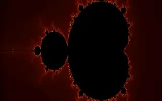
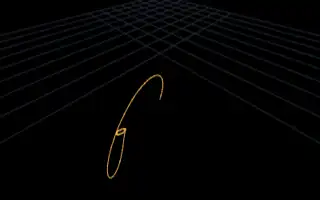
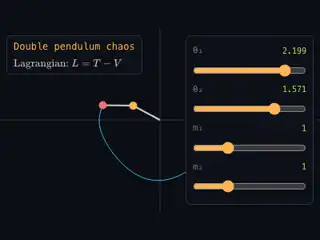
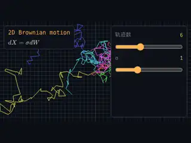
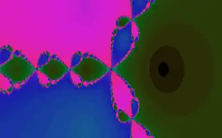
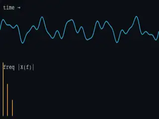
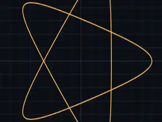
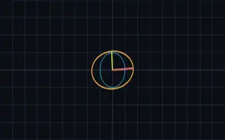
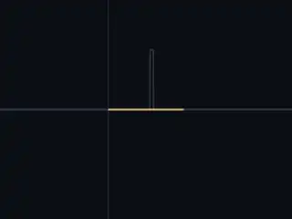

# mathlet

**734 interactive math formula visualizations** — every formula is a live canvas with adjustable parameters. 25 domains. Zero framework. Vite + TypeScript strict + KaTeX + Three.js, custom 80-LOC reactive runtime, SSG to Cloudflare Pages.

→ **Live**: <https://math.htpu.net>

## Sample visualizations

|  |  |  |  |
|:-:|:-:|:-:|:-:|
|  |  |  |  |
| Mandelbrot set | Lorenz attractor | Double pendulum | Conway glider |
|  |  |  |  |
| Lenia | Brownian motion | Newton fractal | FFT spectrum |
|  |  |  |  |
| Spirograph | SVD geometry | α-helix protein | Schrödinger 1D |

## What's inside

- **734 formulas** across 25 domains: algebra, geometry, calculus, linear algebra, ODE, PDE, probability, fractal, topology, number theory, signals, optimization, vector field, cellular automata, biology, chemistry, quantum, graph, crypto, music, general relativity.
- **5 difficulty levels** (L1 to L5).
- **Two render surfaces**: `canvas2d` for 2D plots, fields, fractals, CA; `three` for 3D surfaces, molecules, attractors.
- **Templates** (`src/templates/`): `fn1d`, `param2d`, `polar`, `escape`, `ode2d`, `ode3d`, `surface3d`, `ifs`, `ca1d`, `ca2d`, `vfield2d`, `rwalk`, `matrix2d`, `histogram` — pick the right template, write 10 lines, ship a formula.
- **i18n**: 中 / EN / ES with full coverage on all 734 entries.
- **SSG**: per-formula prerendered HTML for SEO + KaTeX noscript fallback + filtered landing pages per domain / level / surface + sitemap with hreflang + per-page BreadcrumbList & ItemList JSON-LD.

## Detail page UX

- **← / →** navigate within domain + level
- **j / k** prev / next across full registry
- **g / G** first / last formula
- **r** reset parameters
- **d** randomize parameters
- **🔗** copy share link with current params
- **/** focus search
- **?** help

## Adding a formula

```ts
// src/formulas/algebra/foo.ts
import { n } from '../types';
import { fn1d } from '../../templates/fn1d';
export default fn1d({
  meta: { slug: 'foo', title: '…', domain: 'algebra', level: 2, tex: '…', blurb: '…' },
  params: [n('a', 'a', 1, -3, 3, 0.01)],
  fn: p => x => Math.sin((p.a as number) * x),
  view: { cx: 0, cy: 0, scale: 60 },
});
```

Then:

```sh
npm run registry   # regenerate _registry.generated.ts + _loaders.generated.ts
npm run dev        # http://localhost:5173/f/foo
```

Slug must be ASCII URL-safe. For 3D formulas, set `surface: 'three'` explicitly — otherwise the canvas defaults to `canvas2d` and renders blank.

## Build

```sh
npm install
npm run dev        # Vite HMR dev server
npm run build      # registry → vite build → ssg (734 detail pages + 28 landings + sitemap)
npm run preview    # serve dist on :4173
npm run deploy     # build + wrangler pages deploy
```

## Architecture

- **`src/runtime/signal.ts`** — ~80 LOC `signal` / `computed` / `effect`. The whole reactive layer.
- **`src/main-index.ts`** — index page: featured row + 25 domain mosaic tiles + filter chips + breadcrumbs.
- **`src/main-detail.ts`** — detail page: parameter sliders bound via signals, URL-synced, keyboard shortcuts, share button.
- **`scripts/generate-registry.ts`** — scans `src/formulas/<domain>/<slug>.ts`, regex-extracts `meta`, writes registry + lazy loader map for chunk splitting.
- **`scripts/ssg.ts`** — JSDOM-based prerender of index + detail + landings; injects KaTeX-rendered TeX, OG/Twitter, JSON-LD, hreflang, sitemap.
- **`scripts/generate-thumbs.ts`** — Playwright + ffmpeg + img2webp pipeline for 320×200 animated WebP thumbnails (24 frames).

## License

MIT.
